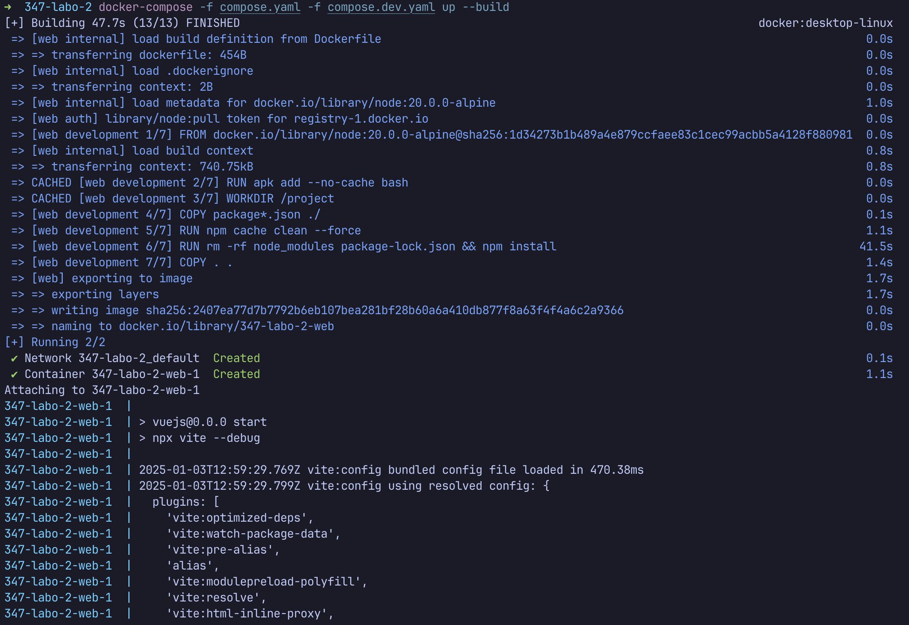
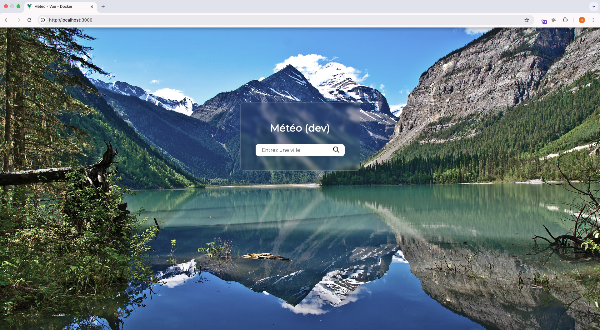
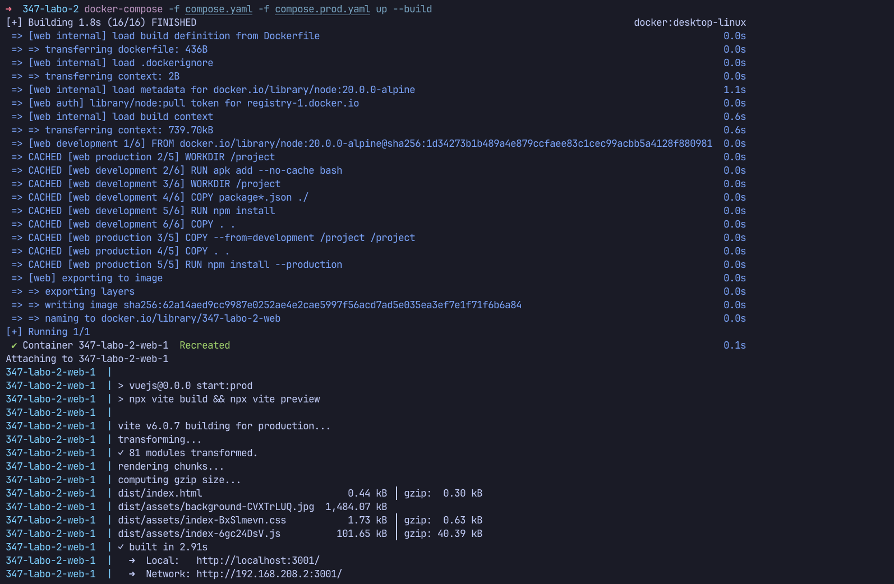
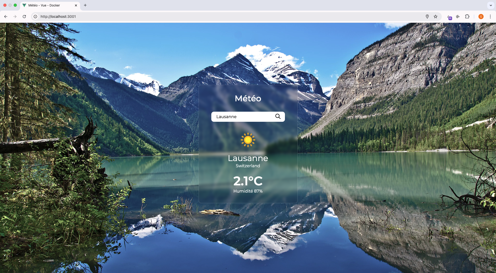
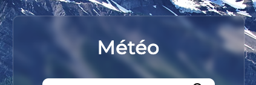
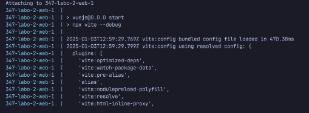
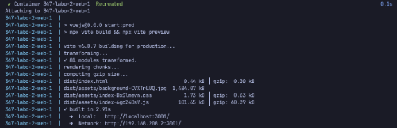

# Module 347 : Labo 2

Application Météo Vue.js

- Gabriel Dovat, José Gomes et Keito Gerber
- Classe DEVA 2A

Cette application permet aux utilisateurs de rechercher les conditions météorologiques actuelles d'une ville en temps réel.

## Structure de l'app

```
├── vuejs/
│   ├── src/
│   ├── dist/
│   └── Dockerfile
├── compose.dev.yaml
├── compose.prod.yaml
└── compose.yaml
```

- `vuejs/Dockerfile`
  Contient la configuration pour construire l'image Docker de l'application Vue.js pour les environnements de développement et de production.

- `compose.dev.yaml`
  Spécifie la configuration de Docker Compose pour l'environnement de développement, en mappant les volumes et définissant l'environnement de développement.

- `compose.prod.yaml`
  Spécifie la configuration de Docker Compose pour l'environnement de production, en définissant la commande de démarrage et en optimisant l'application pour la production.

- `compose.yaml`
  Le fichier principal de configuration Docker Compose qui inclut et orchestre les autres fichiers de configuration pour les environnements dev et prod.

## Lancer l'application en mode développement

Exécutez la commande suivante :

```sh
docker-compose -f compose.yaml -f compose.dev.yaml up --build
```

### Explication de la commande

- `docker-compose` est un outil utilisé pour définir et exécuter des applications multi-conteneurs Docker. Il permet de configurer, démarrer et gérer plusieurs services Docker via un fichier de configuration (généralement un fichier docker-compose.yml).

- `-f compose.yaml` Le `-f` indique à `docker-compose` quel fichier de configuration utiliser pour définir les services et les paramètres de l'application. Ici, compose.yaml est le fichier de base de la configuration Docker Compose, qui contient des configurations globales, des services de base, et qui peut inclure d'autres fichiers de configuration via l'option `-f`.

- `-f compose.dev.yaml` L'option `-f` est utilisée à nouveau pour inclure un second fichier de configuration, ici `compose.dev.yaml`. Ce fichier contient des configurations spécifiques à l'environnement de développement, comme la définition des services à utiliser, les volumes à monter, les ports à exposer, et les variables d'environnement pour le développement.

- `up` est la commande qui permet de démarrer tous les services définis dans les fichiers de configuration. Si les conteneurs n'ont pas encore été construits, cette commande les construit avant de les démarrer.

- `--build` L'option `--build` indique à docker-compose de construire les images Docker des services définis dans les fichiers de configuration avant de les démarrer.

### Résultat attendu (terminal)



### Résultat attendu (browser)



## Lancer l'application en mode production

Exécutez la commande suivante :

```sh
docker-compose -f compose.yaml -f compose.prod.yaml up --build
```

### Explication de la commande

- `docker-compose` est un outil utilisé pour définir et exécuter des applications multi-conteneurs Docker. Il permet de configurer, démarrer et gérer plusieurs services Docker via un fichier de configuration (généralement un fichier docker-compose.yml).

- `-f compose.yaml` Le `-f` indique à `docker-compose` quel fichier de configuration utiliser pour définir les services et les paramètres de l'application. Ici, compose.yaml est le fichier de base de la configuration Docker Compose, qui contient des configurations globales, des services de base, et qui peut inclure d'autres fichiers de configuration via l'option `-f`.

- `-f compose.dev.yaml` L'option `-f` est utilisée à nouveau pour inclure un second fichier de configuration, ici `compose.prod.yaml`. Ce fichier contient des configurations spécifiques à l'environnement de production, comme la définition des services à utiliser, les volumes à monter, les ports à exposer, et les variables d'environnement pour le développement.

- `up` est la commande qui permet de démarrer tous les services définis dans les fichiers de configuration. Si les conteneurs n'ont pas encore été construits, cette commande les construit avant de les démarrer.

- `--build` L'option `--build` indique à docker-compose de construire les images Docker des services définis dans les fichiers de configuration avant de les démarrer.

### Résultat attendu (terminal)



### Résultat attendu (browser)



## Quelles sont les différences entre l'environnement de développement et celui de production ?

- Le port de l'environnement de développement est `3000` tandis que celui de l'environnement de production est `3001`. Ce qui permet de faire tourner les deux environnements simultanément sur la même machine

- Le titre du widget change :

<div style="display: flex; align-items: center; gap: 20px; flex-wrap: wrap; justify-content: center;">
    <div style="display: flex; align-items: center; flex-direction: column;">
        <span>Développement</span>
        
    </div>
    <div style="display: flex; align-items: center; flex-direction: column;">
        <span>Production</span>
        
    </div>
</div>
<br />

- En mode développement, au chargement de la page il n'y a aucune ville par défaut, tandis qu'en production, la ville au chargement de la page sera chargée en fonction de la position de l'utilisateur  


<br />

- En mode développement, le `DEBUG` est activé, donc on a des logs sur ce qu'il se passe dans la console, tandis qu'en production il est désactivé. 

<div style="display: flex; align-items: center; gap: 20px; flex-wrap: wrap; justify-content: center;">
    <div style="display: flex; align-items: center; flex-direction: column;">
        <span>Développement</span>
        
    </div>
    <div style="display: flex; align-items: center; flex-direction: column;">
        <span>Production</span>
        
    </div>
</div>
